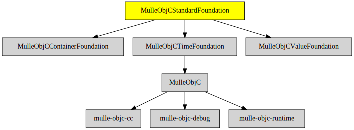

# MulleObjCStandardFoundation

#### 🚤 Objective-C classes based on the C standard library

This library builds on [MulleObjCValueFoundation](//github.com/MulleFoundation/MulleObjCValueFoundation)
and [MulleObjCContainerFoundation](//github.com/MulleFoundation/MulleObjCContainerFoundation) and
introduces a lot of additional classes.

But it does not I/O (not even `stdio`). I/O is provided by 
MulleObjCOSFoundation.

| Release Version                                       | Release Notes
|-------------------------------------------------------|--------------
|  [](//github.com//MulleObjCStandardFoundation/actions)| [RELEASENOTES](RELEASENOTES.md) |


## API

### Classes

| Class                  | Description
|------------------------|-----------------
| `NSAssertionHandler`   | Used by `NSAssert()`
| `NSCalendarDate`       | A composition of `NSDate` and `NSTimeZone`
| `NSCharacterSet`       | Character classification like `<ctype.h>`
| `NSDateFormatter`      | `NSDate` to `NSString` representation
| `NSError`              | A wrapper for `<errno.h>`
| `NSException`          | Exceptions for @throw
| `NSFormatter`          | Object to `NSString` representation
| `NSLocale`             | Localization support
| `NSNotification`       | Message encapsulation for `NSNotificationCenter`
| `NSNotificationCenter` | Publish/subscribe message sending
| `NSNumberFormatter`    | `NSNumber` to `NSString` representation
| `NSScanner`            | Parse from `NSString` into `NSNumber`
| `NSSortDescriptor`     |
| `NSTimeZone`           |
| `NSUndoManager`        |


## Requirements

|   Requirement         | Release Version  | Description
|-----------------------|------------------|---------------
| [MulleObjCTimeFoundation](https://github.com/MulleFoundation/MulleObjCTimeFoundation) |  [](https://github.com///actions/workflows/mulle-sde-ci.yml) | 💰 MulleObjCTimeFoundation provides time classes
| [MulleObjCValueFoundation](https://github.com/MulleFoundation/MulleObjCValueFoundation) |  [](https://github.com///actions/workflows/mulle-sde-ci.yml) | 💶 Value classes NSNumber, NSString, NSDate, NSData
| [MulleObjCContainerFoundation](https://github.com/MulleFoundation/MulleObjCContainerFoundation) |  [](https://github.com///actions/workflows/mulle-sde-ci.yml) | 🛍 Container classes like NSArray, NSSet, NSDictionary
| [mulle-objc-list](https://github.com/mulle-objc/mulle-objc-list) |  [](https://github.com///actions/workflows/mulle-sde-ci.yml) | 📒 Lists mulle-objc runtime information contained in executables.

### You are here



## Add

Use [mulle-sde](//github.com/mulle-sde) to add MulleObjCStandardFoundation to your project:

``` sh
mulle-sde add github:MulleFoundation/MulleObjCStandardFoundation
```

## Install

### Install with mulle-sde

Use [mulle-sde](//github.com/mulle-sde) to build and install MulleObjCStandardFoundation and all dependencies:

``` sh
mulle-sde install --prefix /usr/local \
   https://github.com/MulleFoundation/MulleObjCStandardFoundation/archive/latest.tar.gz
```

### Manual Installation

Install the requirements:

| Requirements                                 | Description
|----------------------------------------------|-----------------------
| [MulleObjCTimeFoundation](https://github.com/MulleFoundation/MulleObjCTimeFoundation)             | 💰 MulleObjCTimeFoundation provides time classes
| [MulleObjCValueFoundation](https://github.com/MulleFoundation/MulleObjCValueFoundation)             | 💶 Value classes NSNumber, NSString, NSDate, NSData
| [MulleObjCContainerFoundation](https://github.com/MulleFoundation/MulleObjCContainerFoundation)             | 🛍 Container classes like NSArray, NSSet, NSDictionary
| [mulle-objc-list](https://github.com/mulle-objc/mulle-objc-list)             | 📒 Lists mulle-objc runtime information contained in executables.

Install **MulleObjCStandardFoundation** into `/usr/local` with [cmake](https://cmake.org):

``` sh
cmake -B build \
      -DCMAKE_INSTALL_PREFIX=/usr/local \
      -DCMAKE_PREFIX_PATH=/usr/local \
      -DCMAKE_BUILD_TYPE=Release &&
cmake --build build --config Release &&
cmake --install build --config Release
```

## Author

[Nat!](https://mulle-kybernetik.com/weblog) for Mulle kybernetiK


